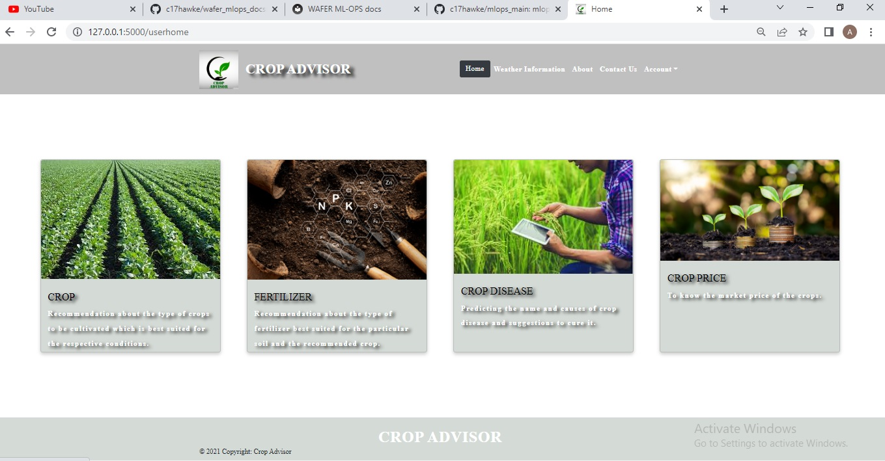
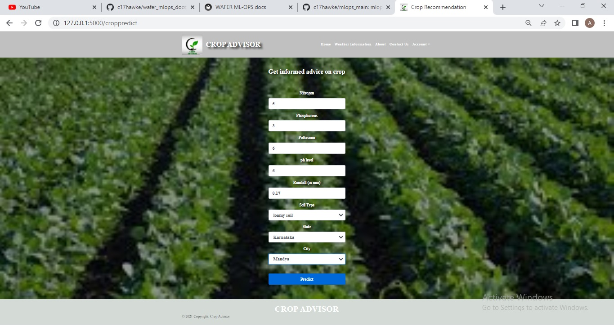
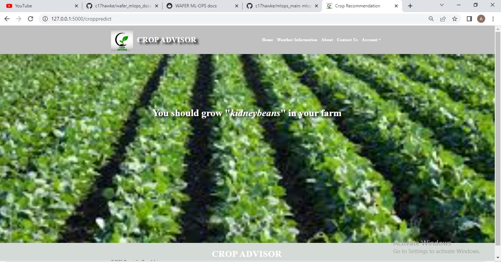
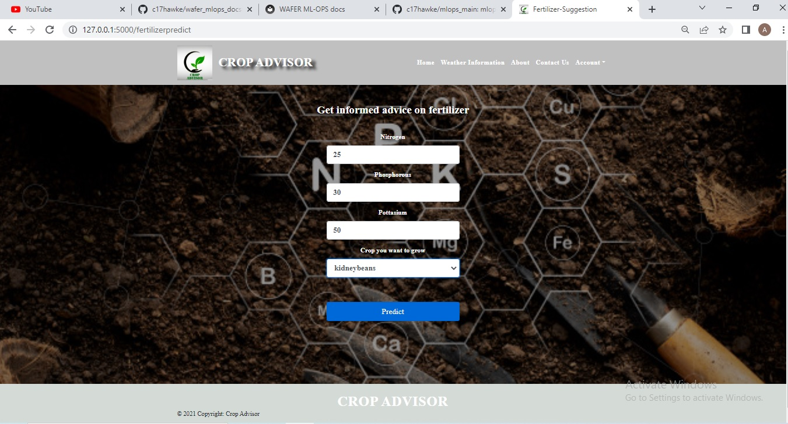
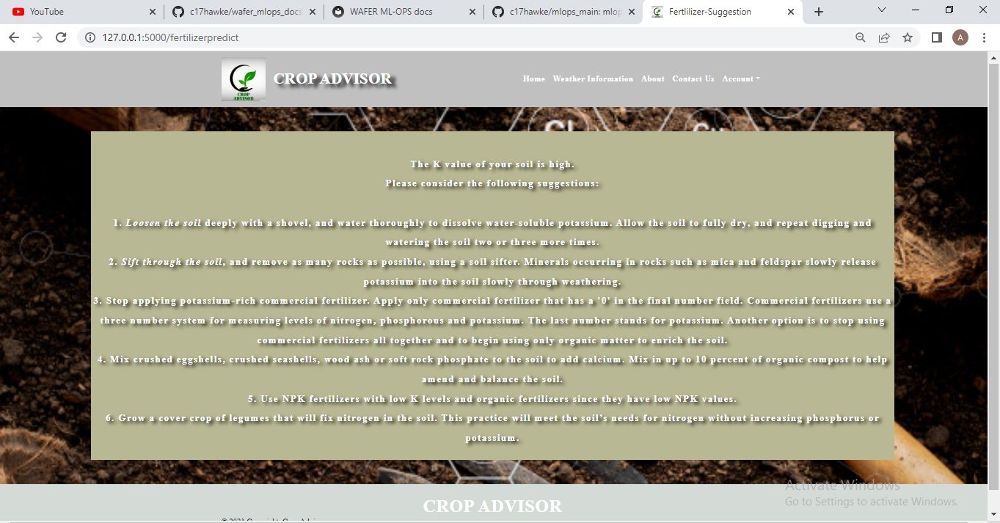
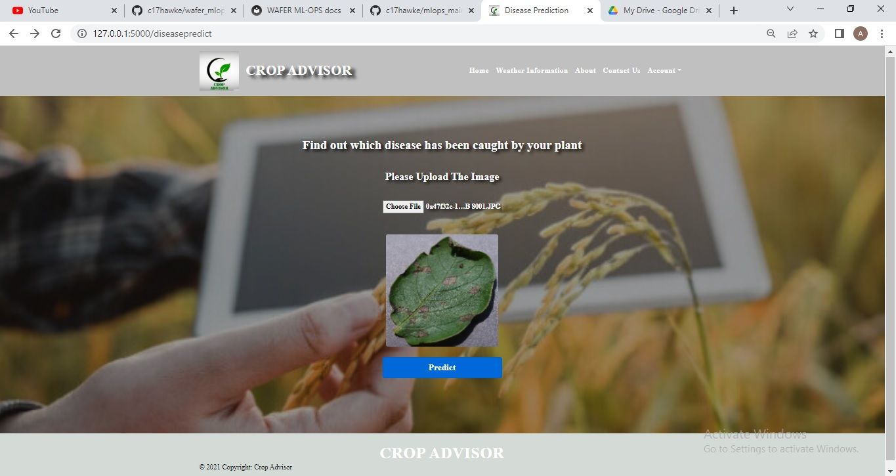
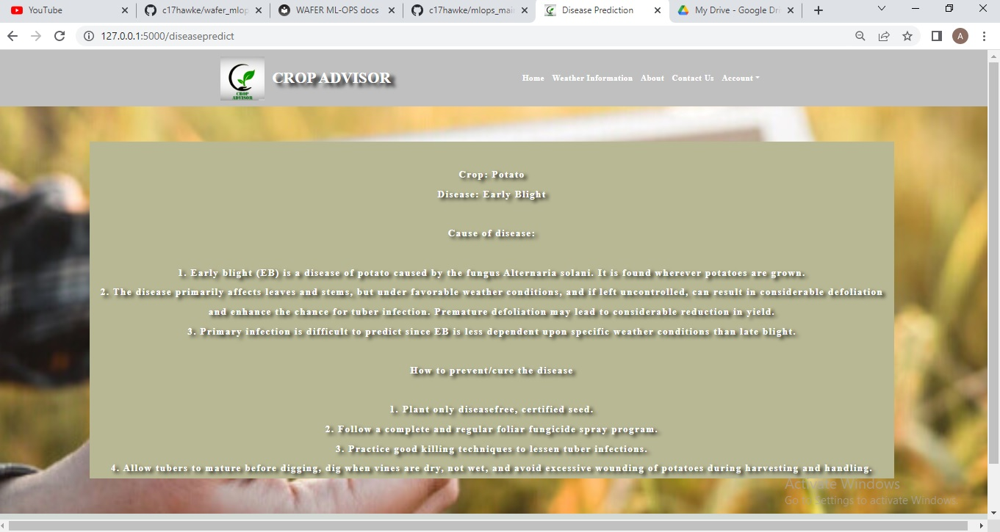
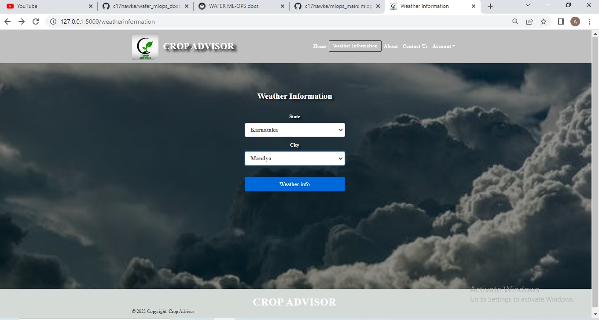
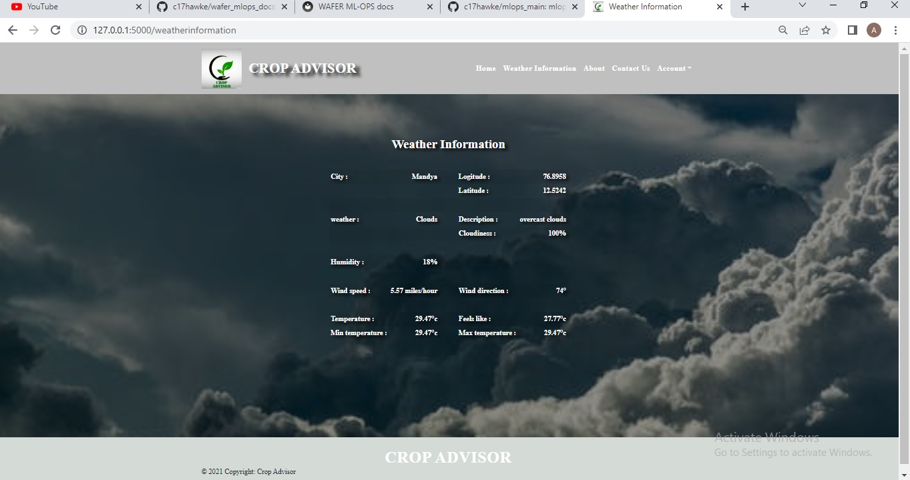

# Crop-Advisor-Deployed

The main goal of the project is to help the farmers to identify which crop get better yield for them based on the features like rain fall in their region, N P K fertilizer content in their soil, soil type( black soil, red soil, sandy soil etc.) and some more. Additionally provide other features to predict the fertilizers and diseases.
The User Interface is very friendly just by up loading required information the user can get the information like, the crop which give better yield, predict the fertilizers for particular crop and predict the diseases.
 
The models for the project is developed using Deep learning and machine learning.

The project is developed using Flask framework.

Few Screenshots from the projects are here.

## Project Url
https://crop--advisor.herokuapp.com/

### User Home
 

### Getting advice related to which crop will give better yield according to the attributes.
&nbsp;&nbsp;&nbsp;&nbsp;&nbsp;&nbsp;&nbsp;&nbsp;&nbsp;&nbsp;&nbsp;&nbsp;

### Getting advice related to fertilizers.
&nbsp;&nbsp;&nbsp;&nbsp;&nbsp;&nbsp;&nbsp;&nbsp;&nbsp;&nbsp;&nbsp;&nbsp;

### Predicting Diseases and solution to get rid of those diseases.
&nbsp;&nbsp;&nbsp;&nbsp;&nbsp;&nbsp;&nbsp;&nbsp;&nbsp;&nbsp;&nbsp;&nbsp;

### Getting Weather Information
&nbsp;&nbsp;&nbsp;&nbsp;&nbsp;&nbsp;&nbsp;&nbsp;&nbsp;&nbsp;&nbsp;&nbsp;
